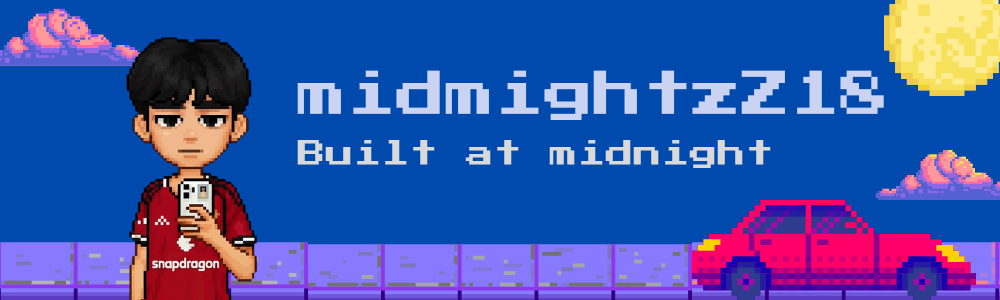

<h1 align="left">Hello World 🌏 </h1>

  

<h3 align="center">Front-End Developer from Thailand 🇹🇭</h3>

Passionate about creating modern, responsive, and user-friendly web experiences.

---

## 👨‍💻 About Me

My name is Teerapong Homchuen (Midnight). I recently graduated from Naresuan University with a Bachelor's degree in Computer Science. 
I am passionate about computers and web development. 
I am currently seeking opportunities to apply my knowledge and skills in real-world projects and continue improving my abilities.

🚀 Looking for opportunities as a Junior  Developer.

---

## 🌐 Socials

  

---

## 🚀 Tech Stack

---

## 📊 GitHub Stats

  
  

---

Thanks for visiting my profile 🙌

